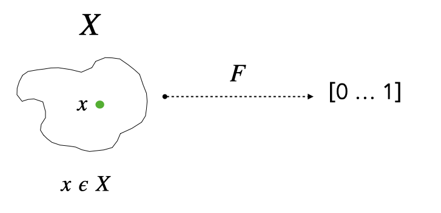
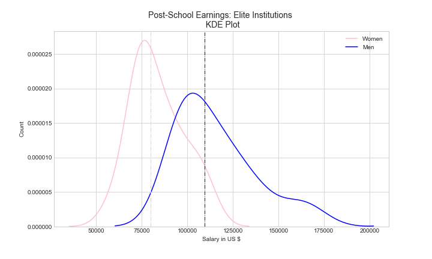
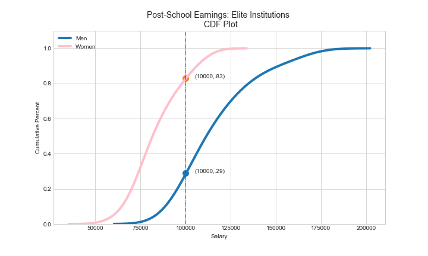

---
title: Cumulative Distribution Functions, Part I
author: Alfred Essa
date: '2021-04-02'
slug: cumulative-distribution-function
categories: [statistics, data science]
tags: ["statistics","cumulative distribution function","probability distribution function","z-score"]
---


Let's make changes and see if it propagates. 


If you is an aspiring data scientist, you are likely to be familiar with **Histograms** and **Probability Density Functions**. Both are well known tools for analyzing distributions. By contrast, **Cumulative Distribution Functions** (CDFs) are not as well known. Most introductory statistics and data science textbooks neglect it entirely or give it short shrift. This state of affairs is unfortunate since CDFs are easy to understand and easy to implement. CDFs deserve to be a standard tool in every data scientist’s toolkit. 

- In Part I, I provide a conceptual introduction to CDFs. 
- In Part II, I demonstrate how to use CDFs with Python and R.
- In Part III, I relate CDFs to Probability Density Functions.

# 1. CDF is a Function

Let's begin with the first key idea for understanding CDFs. A CDF is a *function*: it *maps* an input to an output. The domain of the function is a set $X$ and the range is a probability between 0 and 1. 


{width=75%}


Let's introduce some further terminology. We will represent the CDF function as $F(x)$. The function's domain is the set $X$. We write $x \epsilon X$ to indicate that $x$ is an element of $X$. The domain of the function $F(x)$ is the set of real numbers, $\mathbb{R}$. The range of the function $F(x)$ is also the set of reals $\mathbb{R}$, with the values restricted between 0 and 1 to represent probabilities.
  
 
> **Key Idea**: A CDF is a *function* $F(x)$ which maps members of a set $X$ to a probability $p$. 

 
As we work through our understanding of CDF, the key question we will need to bear in mind at all times is how to interpret these probabilities: 

> **Key Question**: What does the probability $p$, the output of the CDF function, mean?

If you are able to answer this question to yourself and others, then you will have understood the basics of a Cumulative Distribution Function.

**An Aside**: While we are on the topic of probabilities as output of a function, is there another commonly used function in data science which outputs probabilities? There are many. But if you don't know it already, you should become familiar with the [sigmoid function](https://en.wikipedia.org/wiki/Sigmoid_function), which is the basis of [logistic regression](https://en.wikipedia.org/wiki/Logistic_regression). The sigmoid function often makes a guest appearance in deep learning. 


# 2. Formal Definition

Let's return to CDFs. Understanding a technical topic requires juggling the concrete and the abstract. We will stay on the side of abstraction just a moment longer. 

In this section we provide a *formal definition* of CDF. It's perfectly all right if you don't grasp the formal definition right away. We will soon dive in with examples and a case study. 

 > **Definition**: The CDF of a random variable $X$, evaluated at $x$, is the probability that $X$ will take a value *less than or equal* to $x$.
 

The definition is a mouthful, but no need to panic. Let's dissect the definition step-by-step.

- Our starting point is a set $X$.

- CDF is a function, $F(x)$
 
- As a function, $F(x)$ maps each value $x$ in $X$ to a probability $p$, where $0 \leq p \leq 1$. 
 
- The CDF function $F(x)$ is alternatively written as $P(X \leq x)$
 

The last bullet should be read as "the probability that an arbitrary member of $X$ will have a value less than $x$." It will take us a bit of time to unpack this idea fully. But let's begin with the intuition behind the definition. 

Suppose we are at a party. We look around the room and it appears to be a party of very tall people, possibly basketball players. But how tall are the people at this party? If we knew everyone's heights, we know how to calculate basic statistics such as the mean and standard deviation. But let's see what CDF adds to our knowledge of the height of the party goers. At this point, a distinction to keep in mind is that the mean and standard deviation are properties of the distribution. The CDF, however, is a property assigned to each point or member of the distribution. 

Returning to the party, we notice that everyone is wearing a name tag. The tag displays the person's name, but also their height and their "CDF" number. When we approach an individual named "John Quick", for example, his tag displays his name, lists his height as 6'4" and his "CDF number" as .2. 

We want to know the meaning of this CDF number? The CDF numbers means that if we *were* to approach a *random* individual at the party, the *probability* of their height being **6'4" or less** is .2. (Think of drawing a random individual from persons in the room and checking that random individual's height.) Conversely, the probability of the random individual's height being **greater than 6'4"** is .8. 

What can we conclude from this? One thing we can conclude is that although John Quick is tall at 6'4", his height *relative* to all party goers is quite short. Eighty percent of the party goers are taller than John Quick, while only twenty percent are shorter.

Next, we come across Jane Sharp. Her height is listed as 6'9" and her CDF is .9. Once again, we can translate this information to mean that if we were to approach a random person at the party, the probability of their height being 6'9" or *less* is .9. Conversely, the probability of the random individual's height being greater than 6'9" is .1. We can conclude, therefore, that Jane Sharp is among the taller people in the room. Only ten percent of the party goers are taller than 6'9".


If you have been following the argument, then you will have seen straight away that the CDF probabilities are really percentiles! A CDF *positions* each point in a distribution relative to all the other points.

# 3. CDFs are Percentile Ranks

 
What is a percentile? A percentile in statistics measures the percentage of observations below a certain value. For example, if Jane Sharp scores in the 90th percentile in an exam, it means 90\% of people scored below her. Conversely, 10\% of people scored above her. 

When we learn descriptive statistics we begin with three basic ideas: *measures of central tendency*; *measures of variability*; and *measures of position*. The mean of a set of points is an example of central tendency. The standard deviation is a measure of variability. CDF as percentiles allows us to locate a point's *position* relative to other points in the distribution.


> **Key Idea**: CDFs are equivalent to percentile ranks. A CDF tells us the percentage or fraction of values in a distribution less than or equal to our value of interest.


Let's deepen our understanding of CDFs with another example. Suppose we want to analyze the distribution of household income in the United States by state. Our dataset is median household income by state for the year 2019. **Table 1** below displays the first few rows from the dataset.
```


A plot of the histogram provides a quick glance at the distribution.  Lowest median household income is approximately 45K, highest is double that at approximately 85K, and the median is at 61K.


{width=75%}


At this point, a natural question to ask is which US states fall on the low end of the distribution and which ones on the high end? There are various techniques available to us to do this. For example, we can easily sort the data and find which are at the top and bottom ends of the distribution. Sorting is convenient but its usefulness diminishes with large datasets. Is there an alternative to sorting? Is there a general technique which tell us *precisely* where a point is located in the distribution *relative* to *all* the other points.


There is, and you are probably thinking of [z-scores](https://en.wikipedia.org/wiki/Standard_score). Z-scores are sometimes called standard scores. What is a z-score? A z-score is also a function. What does the z-score function do? It maps each raw score in a distribution to a *distance*. The distance is the *number of standard deviations* the raw score is above or below the mean. 

Z-scores have numerous advantages. One among these is that it allows us to place a raw score *relative* to the entire distribution, which is what we want. If we apply z-scores, for example, to three points in our dataset (e.g. the values corresponding to Texas, Massachusetts, and Alabama) we get:

- Texas = -0.07
- Massachusetts = 1.82
- Alabama = -1.19

The result tells us that Texas is slightly below the mean. Massachusetts is two standard deviations above the mean. And Alabama is approximately one standard deviation below the mean. Z-scores get us what we want, namely to locate the relative position of each point in the distribution. But z-scores also have a major drawback. Because a z-score is a technical concept in statistics, communicating its meaning to a lay audience can be quite challenging. 

This is where CDFs as percentiles can come to the rescue. They work similarly to z-scores but are easier to interpret and communicate. Let's apply the CDF function to the three states above. The CDF function returns the following probabilities:

- Texas = .58
- Massachusetts = .94
- Alabama = .12

We can interpret the probabilities returned by the CDF function as percentiles. Massachusetts is on the high end with a 94th percentile rank. Alabama is on the low end with a 12th percentile. And Texas comes out somewhere in the middle with a 58th percentile. Only 6\% of US states have a higher household income than Massachusetts; 42 \% of states have a higher household income than Texas; and 88 \% of states have a higher household income than Alabama.

 > **Key Idea**: CDFs and Z-scores are similar. Both are functions which allow us to place a point's place in a distribution relative to other points.

What have we learned thus far? If we have a continuous random variable such as heights or household income, we can map each value to its corresponding z-score and CDF probability. **Table 2** shows the household income for each state alongside its z-score and CDF score.


# 4. Plotting the CDF Function

Thus far we have used CDF to map single values to a probability. But CDF's power also derives from our ability to visualize it. Let's go ahead and plot the CDF function for the dataset on household income. The **x-axis** is household income. The **y-axis** is probability. The three vertical lines show Alabama, Texas, and Massachusett's position in the CDF plot. The intersection of the vertical lines with the CDF plots gives the value of the probability (or percentiles) for the three states. 
\
\

{width=75%}
\
\
\
A CDF plot provides an alternative way of visualizing distributions. It can be especially useful for comparing the positions of various points in a dataset.

# 5. Case Study: Do Men Earn more than Women?

Let's turn now to a case study to see how we can employ CDF in exploratory data analysis. Our case study involves comparing earnings for men and women. A college education is supposed to be a great equalizer. But does a college education bear fruit equally for men and women?

The data set we examine derives from the [College Scorecard](http://collegeboard.org), which measures earnings among college students ten years after entering college or six years after graduation. We will examine a subset of the data: students who enrolled at elite four-year private nonprofit institutions such as Harvard, Stanford and Princeton.

A listing of the first few records shows the institution and median salaries earned by men and women six years after graduation.

If we plot the distributions comparing men and women we can see right away that there is a significant pay gap. But what's the best to quantify and then communicate the difference between the two distributions? The median salary for men is approximately 110K and for women it's 80K, a large difference.


{width=75%}
\
\
A CDF plot of the data tells a deeper story. The CDF plot shows that six years after graduation 71\% of men are making \$100,000 or more while for women it's only 17\%. That's a staggering difference! The visualization also shows that earnings for women plateaus as it reaches 100K while for men the curve begins to take off at 100K. 


{width=75%}
\
\


CDFs also provide a quick way to calculate relative risk or Risk Ratios. Relative risk is commonly used as a measure for comparing two groups in ecology, medicine, and intervention studies. Mathematically, relative risk is a ratio of probabilities. In our case, the probability of women earning 100K is .17, while for men it's .71. The risk ratio,therefore, is: .71/.17 = 4.18. This means that woman have approximately 4x or 4 times the risk of **not** earning 100K compared to men. Preliminary exploratory data analysis seems to confirm that when it comes to earnings, being a woman is a major handicap even for those who have graduated from elite institutions.

# 6. Summary

I hope to have convinced you that CDFs can be a useful tool for analyzing data. Whenever we have a distribution we should begin by analyzing three basic properties: its central tendency, its variability, and the position of its data elements. CDFs are a useful for getting at this third aspect of distributions. In the next post, I will show that programming CDFs in Python and R is straightforward and can be achieved with only a few lines of code.


 
